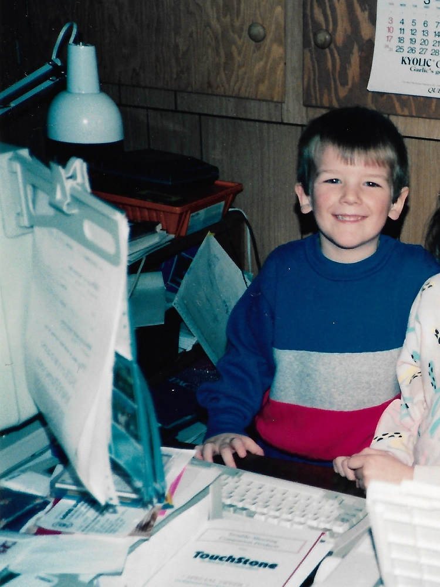
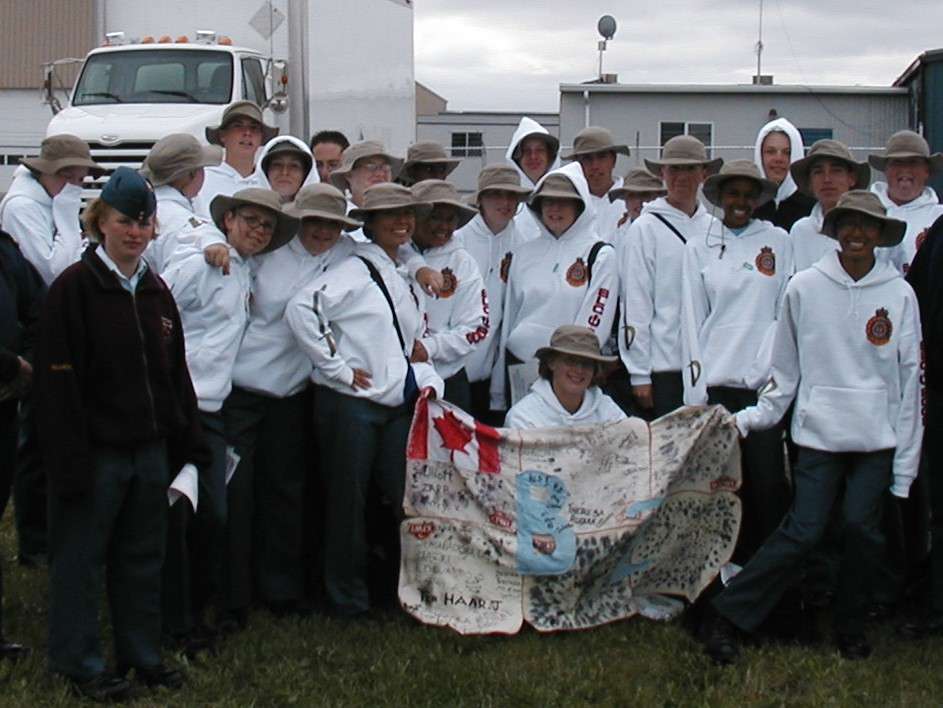
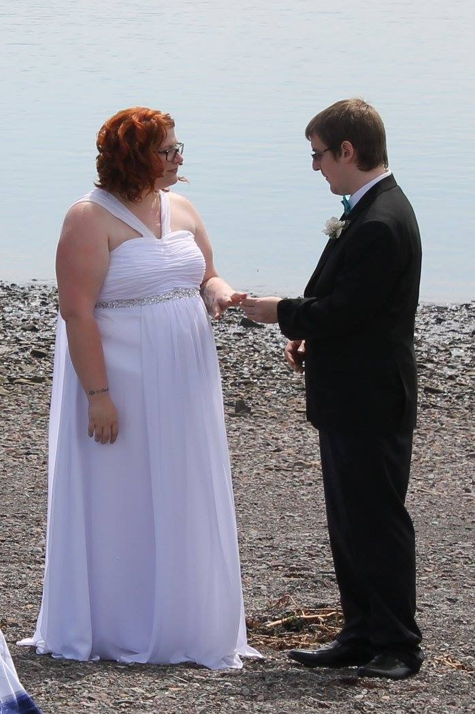
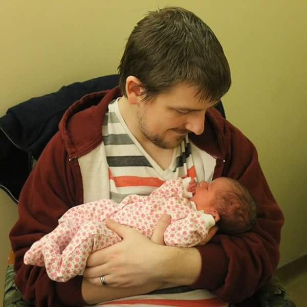
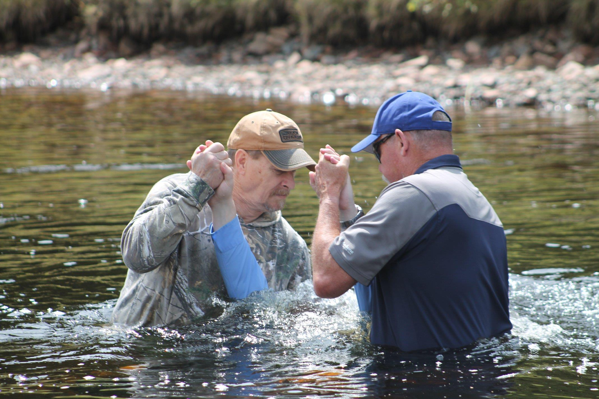

# **About Me**

{:height="75%" width="75%"}

Hi I am <b>Josh Levy</b> :wave:,

I am a married Christian father of two from Nova Scotia. I work as a systems analyst while studying computer science at <a href="https://uopeople.edu/" target="_blank">UoPeople</a>. I have a lot of hobbies, including writing, speedrunning, tabletop RPGs, and coding. I collect and restore <strike>IBM</strike> ThinkPads and other old tech. 

{:height="50%" width="50%"}

Computer systems have fascinated me for my entire life. I have been programming since the age of 4, when I helped copy a personal finance management software line-by-line from a BASIC magazine onto my father's Atari 130XE. At the age of 10, I built my first computer, using an Intel 386 processor, and continued developing my programming skills with QBASIC. A few years later, a family friend who designed ATM software gave me a copy of Microsoft Visual Basic 6.0 and several programming manuals.

{:height="75%" width="75%"}

<small>Air Cadet Senior Leadership Course in Cold Lake, Alberta</small>

For most of my adolescence, I was a member of the local Air Cadet squadron, eventually serving as Squadron Commander. I received the Royal Canadian Legion Medal of Excellence and attended several summer training courses, including the Instructor's Course in Greenwood, NS and the Senior Leadership Course in Cold Lake, AB.

{:height="75%" width="75%"}

In 2015, I married my best friend, Mary-Jane, and became the adoptive father of her daughter, Winter-Jade. When my work offered the option of working from home, the three of us were able to move to my hometown of Parrsboro, Nova Scotia.

{:height="75%" width="75%"}

In 2017, we welcomed Gwendolyn Lorah to our family.

{:height="75%" width="75%"}

<small><a href="https://youtu.be/eFnDdfzPegM" target="_blank">My baptism</a>, summer of 2019</small>

Though I would have described myself as "religious" for most of my adult life, it wasn't until I heard my step-father's testimony one Saturday morning that I re-evaluated my <a href="https://whattimeispurple.com/discover-the-gospel/" target="_blank">relationship with Jesus</a>. Since then, I have become an active member of <a href="https://openarmsparrsboro.ca/" target="_blank">Open Arms Church</a>, serving as an A/V Technician. During the Covid-19 pandemic, I was able to help our small church produce high-quality livestreams of our Sunday services.

I currently study computer science at <a href="https://uopeople.edu/" target="_blank">UoPeople</a>, but my real passion is for theology. After graduating, I hope to continue my formal education at seminary.

<small><b>Theme based on </b><a href="https://youssefraafatnasry.me/portfolYOU">portfolYOU</a></small>
